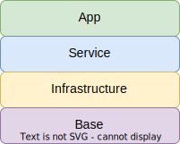

# k8s-cluster-creation

## Prerequisites

The following tools must be installed on the workstation:

* Terraform (1.1.x)
* Helm (3.x)
* gcloud
* python3

## Checklist

* [x] Write simple PHP application and dockerize it
* [x] Write Helm chart for simple PHP application
* [x] Write Terraform code for GKE cluster provisioning
* [x] Write Terraform code for ingress-nginx provisioning
* [x] Write pytest code for application availability check
* [x] Create makefile
* [x] Write minimal documentation

## Environment

Google Cloud Platform sandbox by [A Cloud Guru](https://acloudguru.com)

## Getting started

1. Find GCP project id and put it in an environment variable `GOOGLE_PROJECT`:

    ```sh
    export GOOGLE_PROJECT=<project id>
    ```

2. Authorize to GCP via gcloud:

    ```sh
    gcloud auth login
    gcloud config set project $GOOGLE_PROJECT
    gcloud auth application-default login
    ```

3. Provision base layer:

    ```sh
    make base
    ```

4. Provision infrastructure layer:

    ```sh
    make infrastructure
    ```

    > ⚠️ **WARNING**: null-provisioner runs `gcloud container clusters get-credentials` command. This command adds new context into kubeconfig and switch current context.

5. Provision service layer:

    ```sh
    make service
    ```

6. Deploy application:

    ```sh
    make application
    ```

7. Find an external ip of ingress-nginx service (or ingress resource address) and add it to `/etc/hosts` file with `php-app.example` domain name:

    ```sh
    kubectl get svc ingress-nginx-controller -n ingress-nginx -o jsonpath='{.status.loadBalancer.ingress[0].ip}'
    kubectl get ingress php-app-chart -n php-app -o jsonpath='{.status.loadBalancer.ingress[0].ip}' 
    ```

8. Test application availability:

    ```sh
    make test
    ```

9. Clean all resources in cloud:

    ```sh
    make clean
    ```

## Description

### BISA model

Base Infrastructure Service App model is a way to decompose overall infrastructure into different layers in order to be able to reuse layers and separate areas of responsibility.



#### Base

The main goal of this step is to prepare GCP project:

* Create project
* Set up IAM users and roles
* Enable APIs
* Enable billing
* ...

#### Infrastructure

The main goal of this step is to create cloud resources:

* GKE
* Network resources (VPC, subnets)
* Managed databases
* ...

#### Service

The main goal of this step is to prepare Kubernetes cluster for application deploy and create infrastructure components inside Kubernetes:

* Ingress
* Monitoring and logging tools
* RBAC tools
* ...

#### Application

The main goal of this step is to provision application and provide simple way to update it. In real world it should be done via CI/CD tools like GitLab CI, Circle CI, etc...

## Additional information

### PHP App

Simple hello world application. You cand build it with:

```sh
docker build app -t avtandilko/php-app:v1 
docker push avtandilko/php-app:v1 
```

### To improve

* [ ] Remove hack with postStart hook for nginx deployment in Helm chart
* [ ] Move Terraform state to S3
* [ ] Provide a better way of authorization for Kubernetes and Helm Terraform providers
* [ ] Fix tfsec warnings
* [ ] Remove manual step with DNS hardcode for pytest
